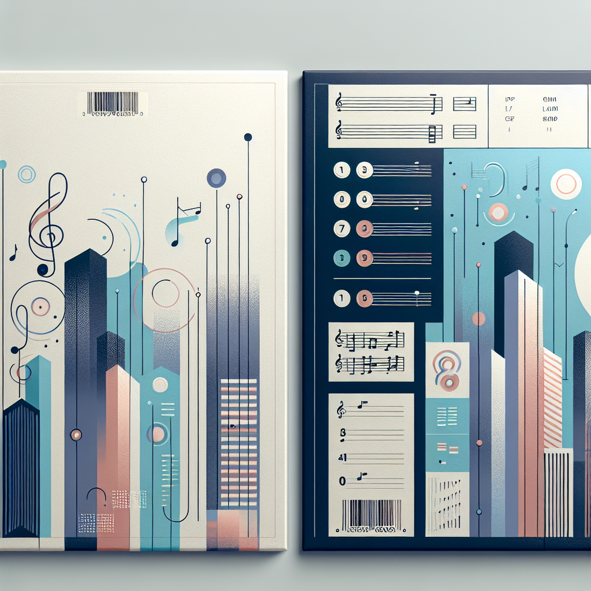
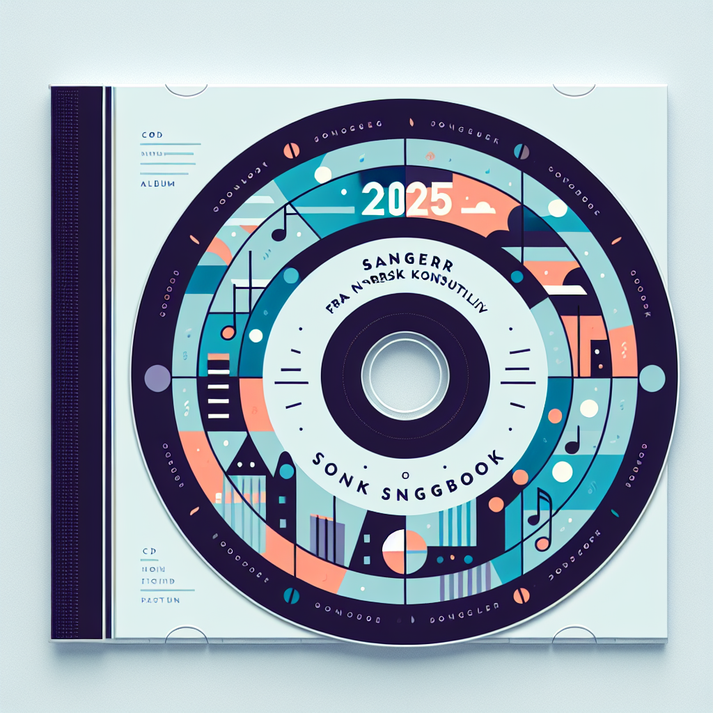

# Image Generation Pipeline Guide

**For AI Agents and Developers**

This document describes the image generation architecture used in **The Consulent Songbook 2025** project. Use this as a reference to replicate the system in other creative projects requiring AI-generated album art, video stills, and design assets.

---

## Overview

This project generates CD design assets (covers, labels) and music video scene images using:
- **OpenAI Images API** (model: `dall-e-3`)
- **Hardcoded prompt arrays** in Node.js scripts (no HTML parsing needed)
- **Node.js ESM scripts** with environment-based configuration
- **Base64 decoding** to save PNG files locally

Key features:
- **Reproducible**: All prompts defined in version-controlled `.mjs` scripts.
- **Idempotent**: Re-running skips existing images.
- **Polite**: Built-in rate-limiting delays (1200ms between calls).
- **Configurable**: Model, size, and quality tunable via `.env`.

---

## Architecture

```
Project Root
├── .env                          # OPENAI_API_KEY and optional config
├── .env.example                  # Template
├── package.json                  # ESM; scripts: generate-design
├── node_modules/
├── images/                       # Output: generated images
│   ├── cover/
│   │   ├── front.png
│   │   └── back.png
│   ├── cd-label/
│   │   └── label.png
│   └── <song-name>/              # Future: per-song video stills
│       ├── scene-01.png
│       └── ...
├── design/
│   ├── generate_design_images.mjs  # Main generator script
│   ├── booklet.md                  # CD booklet content
│   ├── cover-front.md              # Front cover brief
│   ├── cover-back.md               # Back cover brief
│   └── cd-label.md                 # CD label brief
└── Songs/
    └── <song-name>/
        └── image-prompts.md        # Video scene prompts (manual use)
```

---

## Dependencies

Install once from project root:

```powershell
npm install
```

**package.json** (minimal):

```json
{
  "name": "consultant-songbook-2025",
  "type": "module",
  "dependencies": {
    "dotenv": "^16.4.7",
    "openai": "^4.72.0"
  },
  "scripts": {
    "generate-design": "node design/generate_design_images.mjs"
  }
}
```

**Note**: This project does **not** use Cheerio or HTML parsing. Prompts are defined directly in JavaScript arrays within the generator script.

---

## Prompt Format

### Structure

Prompts are defined as JavaScript arrays in `design/generate_design_images.mjs`:

```javascript
const DESIGN_PROMPTS = [
  {
    filename: 'cover/front.png',
    prompt: `Modern album cover titled "The Consulent Songbook 2025"...`
  },
  {
    filename: 'cover/back.png',
    prompt: `Back cover of a music album, clean minimalist layout...`
  },
  {
    filename: 'cd-label/label.png',
    prompt: `Minimalist circular CD label design...`
  }
];
```

### Key Elements

- **filename**: Relative path from `images/` folder (e.g., `cover/front.png`)
- **prompt**: Full DALL·E prompt text with composition, style, colors, and mood

**No HTML parsing**: Prompts are directly in code, making them easy to edit and version-control without external file dependencies.

---

## Generator Script Pattern

### Core Logic

1. **Environment loading**
   - Load `.env` from project root with `dotenv.config()`
   - Validate `OPENAI_API_KEY` is set

2. **Iterate hardcoded prompts**
   - Loop through `DESIGN_PROMPTS` array
   - Each entry contains `filename` and `prompt`

3. **Generate images sequentially**
   - For each prompt:
     - Check if output file exists (skip if present)
     - Create output directory if needed
     - Call `openai.images.generate()` with:
       - `model`: `dall-e-3` (or env override)
       - `prompt`: full text (no art direction suffix added)
       - `size`: `1024x1024` (configurable via env)
       - `quality`: `standard` or `high`
       - `n`: `1` (DALL·E 3 only supports n=1)
       - `response_format`: `b64_json`
     - Decode base64 response and write PNG
     - Sleep 1200ms (polite rate limiting)

4. **Error handling**
   - Catch per-image errors, log, continue
   - Exit with error if `OPENAI_API_KEY` missing

### Minimal Script Template

```javascript
import fs from 'node:fs/promises';
import path from 'node:path';
import { fileURLToPath } from 'node:url';
import dotenv from 'dotenv';
import OpenAI from 'openai';

const __filename = fileURLToPath(import.meta.url);
const __dirname = path.dirname(__filename);
const ROOT = path.resolve(__dirname, '..');
const IMAGES_ROOT = path.resolve(ROOT, 'images');

dotenv.config({ path: path.join(ROOT, '.env') });

const MODEL = process.env.OPENAI_IMAGE_MODEL || 'dall-e-3';
const SIZE = process.env.OPENAI_IMAGE_SIZE || '1024x1024';
const QUALITY = process.env.OPENAI_IMAGE_QUALITY || 'standard';
const N_IMAGES = 1; // DALL·E 3 only supports n=1

const DESIGN_PROMPTS = [
  {
    filename: 'cover/front.png',
    prompt: `Album cover design with title, clean layout, modern style...`
  },
  {
    filename: 'cover/back.png',
    prompt: `Back cover with track list area, minimalist design...`
  }
];

async function main() {
  if (!process.env.OPENAI_API_KEY) {
    throw new Error('OPENAI_API_KEY not set');
  }

  const openai = new OpenAI({ apiKey: process.env.OPENAI_API_KEY });
  console.log(`Generating ${DESIGN_PROMPTS.length} images...`);

  for (let i = 0; i < DESIGN_PROMPTS.length; i++) {
    const { filename, prompt } = DESIGN_PROMPTS[i];
    const outPath = path.join(IMAGES_ROOT, filename);
    const outDir = path.dirname(outPath);

    await fs.mkdir(outDir, { recursive: true });

    if (await exists(outPath)) {
      console.log(`[skip] ${filename}`);
      continue;
    }

    console.log(`[${i + 1}/${DESIGN_PROMPTS.length}] ${filename}`);

    try {
      const res = await openai.images.generate({
        model: MODEL,
        prompt: prompt,
        size: SIZE,
        quality: QUALITY,
        n: N_IMAGES,
        response_format: 'b64_json'
      });
      const data = res.data?.[0]?.b64_json;
      if (!data) throw new Error('No image data');
      await fs.writeFile(outPath, Buffer.from(data, 'base64'));
      console.log(`  saved`);
    } catch (err) {
      console.error(`  failed:`, err?.message || err);
      await sleep(1500);
    }

    await sleep(1200);
  }

  console.log('Done.');
}

async function exists(p) {
  try { await fs.access(p); return true; } catch { return false; }
}
function sleep(ms) { return new Promise(r => setTimeout(r, ms)); }

main().catch(err => { console.error(err); process.exit(1); });
```

---

## Environment Configuration

### .env (project root)

```env
OPENAI_API_KEY=sk-proj-...

# Optional overrides
OPENAI_IMAGE_MODEL=dall-e-3
OPENAI_IMAGE_SIZE=1024x1024
OPENAI_IMAGE_QUALITY=standard
```

### .env.example (committed template)

```env
# OpenAI API Key for image generation
OPENAI_API_KEY=your_openai_api_key_here

# Optional: override defaults
# OPENAI_IMAGE_MODEL=dall-e-3
# OPENAI_IMAGE_SIZE=1024x1024
# OPENAI_IMAGE_QUALITY=standard
```

---

## Usage

### Step 1: Create .env

```powershell
Copy-Item -Path .env.example -Destination .env
# Edit .env and set OPENAI_API_KEY
```

### Step 2: Install dependencies

```powershell
npm install
```

### Step 3: Run generator

```powershell
npm run generate-design
```

### Step 4: Verify output

Images appear in the `images/` folder:
- Front cover: `images/cover/front.png`
- Back cover: `images/cover/back.png`
- CD label: `images/cd-label/label.png`

---

## Art Direction Pattern

This project **does not append** a generic art direction suffix. Instead, each prompt is fully self-contained with:

- **Title/subtitle text** (e.g., "The Consulent Songbook 2025")
- **Visual style** (e.g., "modern Scandinavian design", "flat vector illustration")
- **Color palette** (e.g., "blue, turquoise, lilac with warm orange accent")
- **Composition** (e.g., "consultants around whiteboard with musical notes")
- **Medium** (e.g., "clean, professional, high resolution, print-ready")

**Example prompt structure:**

```
Modern album cover titled "The Consulent Songbook 2025" with subtitle "Sanger fra norsk konsulentliv". 
Stylized illustration of consultants around a whiteboard or laptop mixed with musical notes and instruments. 
Clean Scandinavian design with blue, turquoise, and lilac tones with a warm orange accent. 
Flat vector illustration style, professional and playful, high resolution, suitable for print.
```

---

## Cost and Rate Limiting

### Costs

- **OpenAI Images API** charges per generation (varies by model/quality).
- Example: `dall-e-3` with `quality=standard` and `size=1024x1024` costs ~$0.04 per image; `quality=high` costs ~$0.08 (as of late 2024; check current pricing).
- Generating 3 design images (cover front/back + CD label) = ~$0.12–0.24 USD.

### Rate Limits

- Scripts include 1200ms delays between calls.
- OpenAI may impose per-minute or per-day limits depending on your account tier.
- On rate limit errors (429), wait and re-run; existing files are skipped.

---

## Using Generated Images

After generation:

1. **Review images** in `images/cover/` and `images/cd-label/`
2. **Import into layout tool**:
   - Word, Google Docs, Canva, Figma, or InDesign
   - Use generated images as base layers
   - Add text overlays (title, track list, credits) using `design/*.md` content
3. **Export print-ready PDFs**:
   - Front cover: 12×12 cm (CD jewel case front)
   - Back cover: 12×12 cm with track list area
   - CD label: circular, ~12 cm diameter
   - Booklet: A5 or 12×12 cm folded pages (use `design/booklet.md`)

### Embedding in Documentation

Reference images in README or other markdown:

```markdown
## Design Preview




```

---

## Troubleshooting

### OPENAI_API_KEY not set

- Ensure `.env` exists at project root.
- Confirm it contains `OPENAI_API_KEY=sk-...`.
- Restart terminal after creating `.env`.

### ESM import errors

- Verify `"type": "module"` in `package.json`.
- Use Node 18+ LTS.

### Rate limit (429) errors

- Wait 60 seconds, then re-run.
- Script skips existing files, so you won't lose progress.

### Output folder not found

- Scripts create folders automatically with `fs.mkdir({ recursive: true })`.
- Check file paths in script constants (`OUT_DIR`).

### Image quality issues

- Increase `OPENAI_IMAGE_SIZE` to `1024x1792` (tall portrait) or `1792x1024` (landscape).
- Set `OPENAI_IMAGE_QUALITY=high` in `.env`.
- Refine prompts: add composition, lighting, and detail keywords.
- Edit prompts directly in `design/generate_design_images.mjs` and re-run.

---

## Replicating in Another Project

### Quick Start Checklist

1. **Set up Node.js project**
   - `npm init -y`
   - Set `"type": "module"` in `package.json`
   - Install: `npm install dotenv openai`

2. **Create .env and .env.example**
   - Add `OPENAI_API_KEY=...` to `.env`
   - Commit `.env.example` as a template

3. **Define prompts in script**
   - Create a `DESIGN_PROMPTS` array with `{ filename, prompt }` objects
   - Include full art direction in each prompt (no suffix appending needed)

4. **Write generator script**
   - Copy the minimal template above
   - Adjust `ROOT`, `IMAGES_ROOT` constants
   - Set `model: 'dall-e-3'`, `response_format: 'b64_json'`

5. **Add npm script**
   - `"generate-design": "node design/generate_design_images.mjs"`

6. **Run and verify**
   - `npm run generate-design`
   - Check `images/` folder for PNGs

### Adapt for Other AI Image Services

Replace the OpenAI call with your provider's API:

- **Stability AI (Stable Diffusion)**: Use their Node SDK; decode base64 or download URL.
- **Midjourney**: No official API; consider Discord bot automation (complex).
- **Replicate**: Supports various models; similar async/await pattern.
- **Leonardo.ai**: REST API with similar structure.

Core pattern remains:
1. Define prompts in array
2. Loop through items
3. Call API with prompt + config
4. Decode and save image
5. Add polite delays

---

## Summary

This system provides:
- **Version-controlled prompts** (JavaScript arrays in `.mjs` scripts)
- **Automated batch generation** (Node.js scripts with OpenAI API)
- **Reproducible workflows** (npm scripts + .env config)
- **Simple structure** (no HTML parsing, direct prompt arrays)

Use this guide to replicate the pipeline in any creative project requiring AI-generated album art, book covers, or design assets.

---

**Project**: [The Consulent Songbook 2025](https://github.com/oveku/consultant-songbook-2025)

*Last updated: December 2025*
